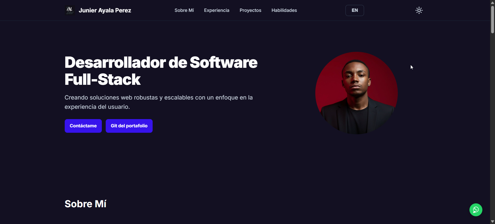
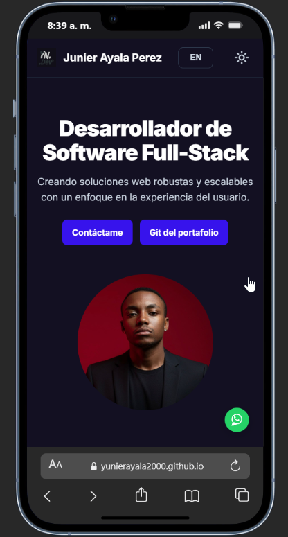
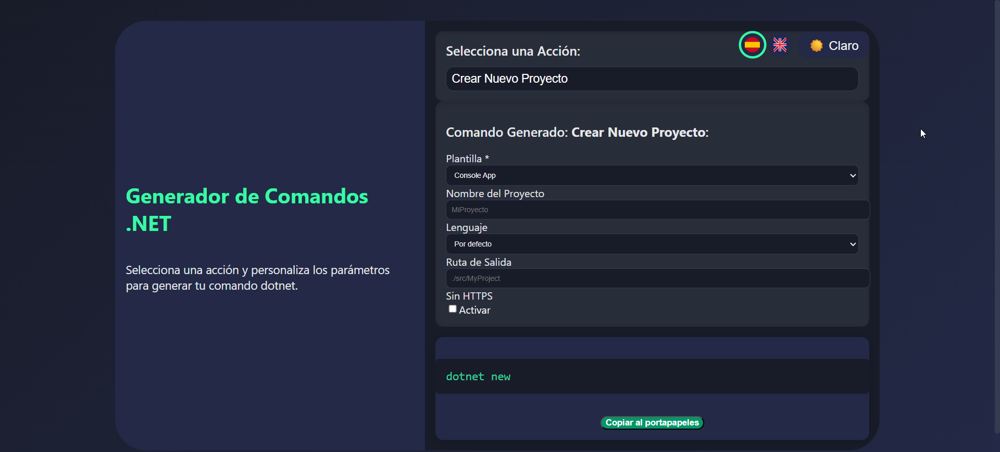
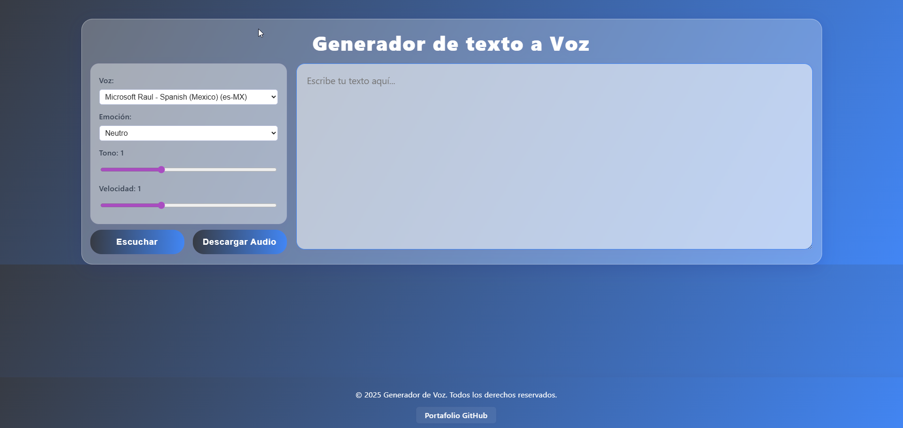
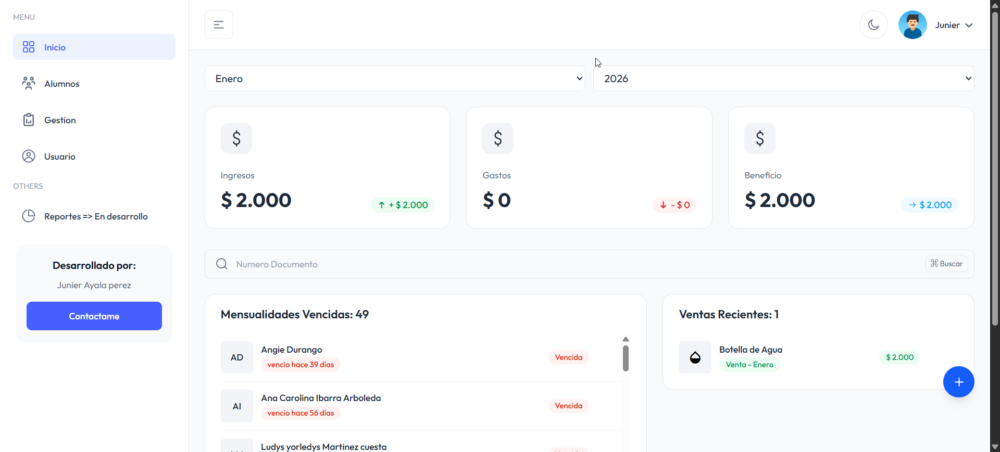
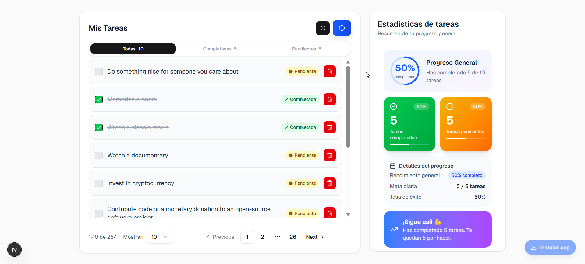
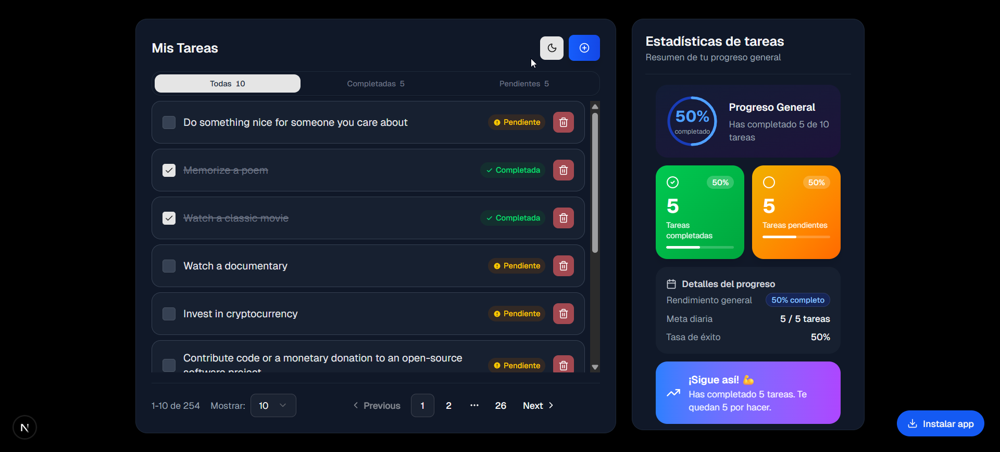
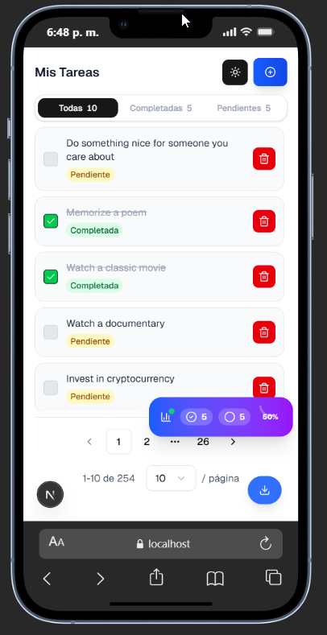
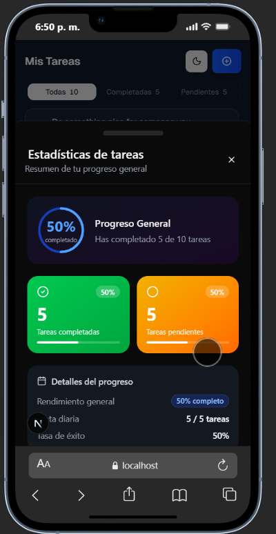

# 🧑‍💻 Junier Ayala Perez — Portfolio Personal

Portafolio web personal desarrollado como Progressive Web App (PWA), con soporte para modo oscuro/claro, internacionalización (ES/EN) y diseño responsive.

---

## 🚀 Demo

🔗 [Ver portafolio en vivo](https://yunierayala2000.github.io) _(actualizar con la URL real)_

---

## 📸 Capturas del portafolio

### Web



### Movil



### Proyectos destacados

#### Generador de Comandos .NET



#### Generador de Texto a Voz



#### YouGym



#### TaskFlow — Vista escritorio (modo claro)



#### TaskFlow — Vista escritorio (modo oscuro)



#### TaskFlow — Vista móvil (modo claro)




#### TaskFlow — Vista móvil (modo oscuro)




---

## 🛠️ Tecnologías utilizadas

### Frontend

| Tecnología            | Uso                                                    |
| --------------------- | ------------------------------------------------------ |
| **HTML5**             | Estructura semántica de todas las páginas              |
| **CSS3**              | Estilos, variables CSS, animaciones, diseño responsive |
| **JavaScript (ES6+)** | Lógica de interacción, carruseles, i18n, tema          |

### Características web

| Característica                | Descripción                                                                                                    |
| ----------------------------- | -------------------------------------------------------------------------------------------------------------- |
| **PWA (Progressive Web App)** | `manifest.json` + `service-worker.js` permiten instalar el portafolio como app nativa en cualquier dispositivo |
| **Service Worker**            | Caché offline para carga rápida sin conexión                                                                   |
| **Web Manifest**              | Íconos, nombre y color de tema para instalación en pantalla de inicio                                          |

### Fuentes y recursos externos

| Recurso                       | Uso                                     |
| ----------------------------- | --------------------------------------- |
| **Google Fonts — Inter**      | Tipografía principal del portafolio     |
| **Material Symbols Outlined** | Íconos vectoriales en botones y enlaces |

### Herramientas de desarrollo

| Herramienta | Uso                      |
| ----------- | ------------------------ |
| **VS Code** | Editor principal         |
| **Git**     | Control de versiones     |
| **GitHub**  | Repositorio y despliegue |

---

## ✨ Funcionalidades

- **Modo oscuro / claro** — Guardado en `localStorage`, activado con un botón en el header
- **Internacionalización (i18n)** — Cambio dinámico entre español e inglés sin recargar la página
- **Carrusel de imágenes** — Proyecto TaskFlow con navegación por flechas y puntos indicadores
- **Scroll suave** — Navegación fluida entre secciones
- **Botón flotante de WhatsApp** — Acceso directo para contacto rápido
- **Diseño responsive** — Adaptado para móvil, tablet y escritorio

---

## 📁 Estructura del proyecto

```
PORTFOLIO-YUN_DEV/
├── index.html              # Página principal
├── styles.css              # Estilos globales
├── script.js               # Lógica JS (tema, i18n, carrusel, scroll)
├── manifest.json           # Configuración PWA
├── service-worker.js       # Service worker para caché offline
├── assets/
│   └── image/              # Foto de perfil e ícono del sitio
├── public/                 # Capturas de pantalla de los proyectos
└── Pages/
    └── Proyect1/           # App embebida: Generador de Comandos .NET
        ├── commandGeneratNet.html
        ├── commandGeneratorApp.js
        └── commandGeneratorStyle.css
```

---

## 📌 Proyectos destacados

### 1. Generador de Comandos .NET

Herramienta web para generar comandos de CLI de .NET, facilitando la creación de proyectos y soluciones a partir de plantillas.

- **Tecnologías:** HTML, CSS, JavaScript
- **Demo:** [Abrir](./Pages/Proyect1/commandGeneratNet.html)

---

### 2. Generador de Texto a Voz

Convierte texto a voz en tiempo real usando la Web Speech API, con controles de velocidad, tono y selección de voz.

- **Tecnologías:** HTML, CSS, JavaScript, Web Speech API
- **Demo:** [yunierayala2000.github.io/Text-A-Voz](https://yunierayala2000.github.io/Text-A-Voz/)
- **Repositorio:** [GitHub](https://github.com/YunierAyala2000/Text-A-Voz)

---

### 3. YouGym

Plataforma multiplataforma para la gestión de gimnasios pequeños: mensualidades, vencimientos, ingresos y registro de alumnos. Instalable como PWA.

- **Tecnologías:** React.js, TypeScript, SQLite, PWA
- **Demo:** [yougym-v2.pages.dev](https://yougym-v2.pages.dev/)

---

### 4. TaskFlow

Aplicación multiplataforma de gestión de tareas y flujo de trabajo. Disponible en móvil, navegador y escritorio gracias a Next.js PWA.

- **Tecnologías:** React.js, TypeScript, Next.js, Tailwind CSS, Next-PWA
- **Demo:** [pt-taskflow-junier-ayala.vercel.app](https://pt-taskflow-junier-ayala.vercel.app/)
- **Repositorio:** [GitHub](https://github.com/YunierAyala2000/pt-taskflow-junier-ayala)

---

## 📬 Contacto

- **LinkedIn:** [yunierayalaperez](https://www.linkedin.com/in/yunierayalaperez)
- **GitHub:** [YunierAyala2000](https://github.com/YunierAyala2000)
- **WhatsApp:** [+57 320 364 1091](https://wa.me/573203641091?text=Vi%20tu%20perfil%20y%20me%20llam%C3%B3%20la%20atenci%C3%B3n)

---

© 2026 Junier Ayala Perez. Todos los derechos reservados.
